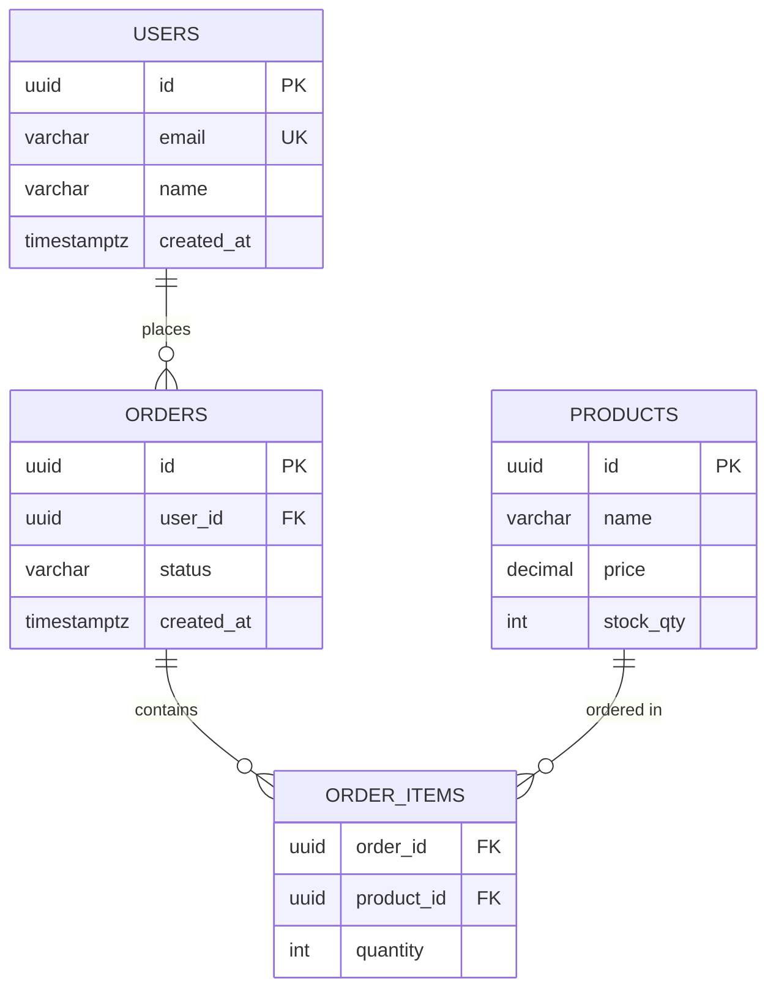

# PostgreSQL Database Designer

Design and implement professional PostgreSQL databases following industry best practices.

## Core Principles

**Data Integrity First**: Every decision prioritizes data accuracy and consistency. Use constraints, foreign keys, and appropriate data types to enforce integrity at the database level.

**Normalization as Foundation**: Eliminate redundant data and prevent update anomalies. Target 3NF (Third Normal Form) unless performance analysis justifies denormalization.

**Schema as Living Document**: Design schemas that adapt to changing requirements without major restructuring. Use extensibility patterns from the start.

**Security by Design**: Implement row-level security, proper access patterns, and encryption for sensitive data from day one.

## Design Lifecycle

### Phase 1: Requirements Analysis

Before writing any SQL, understand the domain:

```
1. Identify entities (nouns in requirements) → potential tables
2. Identify actions/processes (verbs) → potential relationships
3. Identify business rules → constraints
4. Identify reporting/analytics needs → indexes, materialized views
5. Identify security requirements → RLS, encryption, audit trails
```

Ask clarifying questions if requirements are ambiguous:
- What entities exist and what attributes do they have?
- How do entities relate to each other? (1:1, 1:N, N:N)
- What operations will be performed most frequently?
- What are the scalability requirements?

### Phase 2: Conceptual Design (ERD)

Create a high-level entity-relationship diagram using Mermaid:



### Phase 3: Logical Design (Normalized Schema)

Apply normalization rules. Target 3NF:

| Normal Form | Goal | When to Denormalize |
|-------------|------|---------------------|
| 1NF | Atomic values, no repeating groups | When array/json is genuinely appropriate |
| 2NF | No partial dependencies on composite keys | N/A if using surrogate keys |
| 3NF | No transitive dependencies | Read-heavy reporting tables |

Document the logical model:

```markdown
## Logical Model

### Users
| Column | Type | Constraints | Notes |
|--------|------|-------------|-------|
| id | UUID | PK, DEFAULT gen_random_uuid() | Surrogate key |
| email | VARCHAR(255) | UNIQUE, NOT NULL | |
| name | VARCHAR(100) | NOT NULL | |
| created_at | TIMESTAMPTZ | DEFAULT NOW() | |

### Orders
| Column | Type | Constraints | Notes |
|--------|------|-------------|-------|
| id | UUID | PK | |
| user_id | UUID | FK → users(id), NOT NULL | |
| status | VARCHAR(20) | CHECK IN ('pending','confirmed','shipped','delivered','cancelled') | |
| created_at | TIMESTAMPTZ | DEFAULT NOW() | |

### Order_Items (junction table for N:N)
| Column | Type | Constraints | Notes |
|--------|------|-------------|-------|
| order_id | UUID | FK → orders(id) | |
| product_id | UUID | FK → products(id) | |
| quantity | INTEGER | CHECK > 0, NOT NULL | |

### Products
| Column | Type | Constraints | Notes |
|--------|------|-------------|-------|
| id | UUID | PK | |
| name | VARCHAR(255) | NOT NULL | |
| price | DECIMAL(10,2) | CHECK >= 0 | |
| stock_qty | INTEGER | DEFAULT 0, CHECK >= 0 | |
```

### Phase 4: Physical Design (PostgreSQL Optimization)

Choose data types and storage strategies:

```sql
-- Use identity columns for auto-increment (PostgreSQL 10+)
CREATE TABLE users (
    id UUID PRIMARY KEY DEFAULT gen_random_uuid(),
    email VARCHAR(255) NOT NULL UNIQUE,
    name VARCHAR(100) NOT NULL,
    created_at TIMESTAMPTZ NOT NULL DEFAULT NOW()
);

-- Use immutable audit pattern
CREATE TABLE orders (
    id UUID PRIMARY KEY DEFAULT gen_random_uuid(),
    user_id UUID NOT NULL REFERENCES users(id),
    status VARCHAR(20) NOT NULL CHECK (status IN ('pending', 'confirmed', 'shipped', 'delivered', 'cancelled')),
    created_at TIMESTAMPTZ NOT NULL DEFAULT NOW(),
    updated_at TIMESTAMPTZ NOT NULL DEFAULT NOW()
);

-- Order items with historical pricing (capture price at purchase time)
CREATE TABLE order_items (
    id UUID PRIMARY KEY DEFAULT gen_random_uuid(),
    order_id UUID NOT NULL REFERENCES orders(id),
    product_id UUID NOT NULL REFERENCES products(id),
    quantity INTEGER NOT NULL CHECK (quantity > 0),
    price_at_purchase DECIMAL(10,2) NOT NULL,  -- Capture current price at order time
    created_at TIMESTAMPTZ NOT NULL DEFAULT NOW()
);

-- Index strategy: index foreign keys and query columns
CREATE INDEX idx_orders_user_id ON orders(user_id);
CREATE INDEX idx_orders_status ON orders(status);
CREATE INDEX idx_orders_created_at ON orders(created_at DESC);
CREATE INDEX idx_order_items_order_id ON order_items(order_id);
CREATE INDEX idx_order_items_product_id ON order_items(product_id);
```

## Naming Conventions

Follow consistent naming for maintainability:

| Object | Convention | Example |
|--------|------------|---------|
| Tables | plural_snake_case | `users`, `order_items` |
| Columns | singular_snake_case | `user_id`, `created_at` |
| Primary Keys | `id` or `{table_singular}_id` | `id`, `user_id` |
| Foreign Keys | `{referenced_table_singular}_id` | `user_id` |
| Indexes | `idx_{table}_{column(s)}` | `idx_orders_user_id` |
| Constraints | `{table}_{column}_{type}` | `users_email_unique` |
| Sequences | `{table}_{column}_seq` | `users_id_seq` |

## PostgreSQL Extensions

Use appropriate extensions based on requirements:

```sql
-- UUID generation (universally useful)
CREATE EXTENSION IF NOT EXISTS "uuid-ossp"; -- or "pgcrypto"

-- Full-text search
CREATE EXTENSION IF NOT EXISTS pg_trgm; -- for fuzzy matching

-- JSON handling
-- Use JSONB for indexed, structured data
ALTER TABLE products ADD COLUMN metadata JSONB;

-- Hstore for key-value (when JSONB is overkill)
CREATE EXTENSION IF NOT EXISTS hstore;

-- For temporal data
-- Use tsrange/range types for PostgreSQL 9.2+
-- Use tstzrange for timezone-aware ranges
```

## Full-Text Search Patterns

For search features, use weighted tsvector columns with GIN indexes:

```sql
-- Add search_vector column
ALTER TABLE jobs ADD COLUMN search_vector TSVECTOR;

-- Index for fast full-text search
CREATE INDEX idx_jobs_search_vector ON jobs USING GIN(search_vector);

-- Function to update search vector with weights (A=highest, B=medium, C=low)
CREATE OR REPLACE FUNCTION jobs_search_vector_update()
RETURNS TRIGGER AS $$
BEGIN
    NEW.search_vector :=
        setweight(to_tsvector('english', COALESCE(NEW.title, '')), 'A') ||
        setweight(to_tsvector('english', COALESCE(NEW.description, '')), 'B') ||
        setweight(to_tsvector('english', COALESCE(NEW.requirements, '')), 'C');
    RETURN NEW;
END;
$$ LANGUAGE plpgsql;

-- Trigger to auto-update on insert/update
CREATE TRIGGER trigger_jobs_search_vector_update
    BEFORE INSERT OR UPDATE OF title, description, requirements ON jobs
    FOR EACH ROW EXECUTE FUNCTION jobs_search_vector_update();

-- Example search query
-- SELECT * FROM jobs WHERE search_vector @@ plainto_tsquery('english', 'senior developer python');
```

## Implementation Patterns

### Standard Pattern (Raw SQL)

Generate migration files:

```sql
-- migrations/001_create_users.sql
CREATE TABLE users (
    id UUID PRIMARY KEY DEFAULT gen_random_uuid(),
    email VARCHAR(255) NOT NULL UNIQUE,
    name VARCHAR(100) NOT NULL,
    created_at TIMESTAMPTZ NOT NULL DEFAULT NOW()
);

CREATE INDEX idx_users_email ON users(email);

-- migrations/002_create_orders.sql
-- ... etc
```

### ORM Pattern (Prisma/Drizzle)

Generate schema files and suggest documentation:

```prisma
// schema.prisma
model User {
  id        DateTime   @id @default(uuid())
  email     String     @unique
  name      String
  orders    Order[]
  createdAt DateTime   @default(now())
}

model Order {
  id        String   @id @default(uuid())
  userId    String
  user      User     @relation(fields: [userId], references: [id])
  status    String
  items     OrderItem[]
  createdAt DateTime @default(now())
}
```

**Documentation recommendation**: When using ORMs, suggest generating documentation separately since ORM schemas serve as documentation.

## Enterprise Patterns

### Partitioning (Large Tables)

```sql
-- Range partitioning by date
CREATE TABLE readings (
    id BIGSERIAL,
    sensor_id UUID NOT NULL,
    temperature DECIMAL(6,3),
    humidity DECIMAL(6,2),
    pressure DECIMAL(8,3),
    recorded_at TIMESTAMPTZ NOT NULL,
    PRIMARY KEY (id, recorded_at)
) PARTITION BY RANGE (recorded_at);

-- Create monthly partitions
CREATE TABLE readings_2024_01 PARTITION OF readings
    FOR VALUES FROM ('2024-01-01') TO ('2024-02-01');

-- BRIN index for time-series data (append-optimized)
CREATE INDEX idx_readings_recorded_at_brin ON readings USING BRIN (recorded_at);

-- Composite index for sensor-specific time queries
CREATE INDEX idx_readings_sensor_time ON readings (sensor_id, recorded_at DESC);

-- Partition auto-creation function
CREATE OR REPLACE FUNCTION create_monthly_partition(partition_date DATE)
RETURNS void AS $$
DECLARE
    partition_name TEXT;
    start_date DATE;
    end_date DATE;
BEGIN
    start_date := date_trunc('month', partition_date);
    end_date := start_date + INTERVAL '1 month';
    partition_name := 'readings_' || to_char(start_date, 'YYYY_MM');
    EXECUTE format(
        'CREATE TABLE IF NOT EXISTS %I PARTITION OF readings FOR VALUES FROM (%L) TO (%L)',
        partition_name, start_date, end_date
    );
END;
$$ LANGUAGE plpgsql;
```

### Materialized Views (Analytics)

For dashboards and reporting, pre-compute aggregations:

```sql
-- Materialized view for hourly aggregates
CREATE MATERIALIZED VIEW mv_hourly_readings AS
SELECT
    sensor_id,
    date_trunc('hour', recorded_at) AS hour,
    AVG(temperature) AS avg_temp,
    AVG(humidity) AS avg_humidity,
    MIN(temperature) AS min_temp,
    MAX(temperature) AS max_temp,
    COUNT(*) AS reading_count
FROM readings
GROUP BY sensor_id, date_trunc('hour', recorded_at)
WITH NO DATA;

CREATE UNIQUE INDEX idx_mv_hourly ON mv_hourly_readings (sensor_id, hour);

-- Refresh function for materialized views
CREATE OR REPLACE FUNCTION refresh_reading_views()
RETURNS void AS $$
BEGIN
    REFRESH MATERIALIZED VIEW CONCURRENTLY mv_hourly_readings;
END;
$$ LANGUAGE plpgsql;
```

### Row-Level Security (Multi-Tenant)

```sql
-- Enable RLS on tables
ALTER TABLE tenants ENABLE ROW LEVEL SECURITY;
ALTER TABLE users ENABLE ROW LEVEL SECURITY;

-- Force RLS even for table owners
ALTER TABLE tenants FORCE ROW LEVEL SECURITY;
ALTER TABLE users FORCE ROW LEVEL SECURITY;

-- RLS policies for tenant isolation
CREATE POLICY tenant_isolation_policy ON tenants
    USING (id = current_setting('app.tenant_id', true)::UUID);

CREATE POLICY users_tenant_isolation_policy ON users
    USING (tenant_id = current_setting('app.tenant_id', true)::UUID);

-- Application roles for access control
CREATE ROLE app_user;
CREATE ROLE app_service;

-- Grant permissions to app_user role
GRANT CONNECT ON DATABASE CURRENT TO app_user;
GRANT USAGE ON SCHEMA public TO app_user;
GRANT SELECT, INSERT, UPDATE, DELETE ON ALL TABLES IN SCHEMA public TO app_user;
GRANT USAGE, SELECT ON ALL SEQUENCES IN SCHEMA public TO app_user;

-- app_service bypasses RLS for migrations and admin tasks
GRANT ALL ON ALL TABLES IN SCHEMA public TO app_service;
GRANT ALL ON ALL SEQUENCES IN SCHEMA public TO app_service;

-- Helper functions for context management
CREATE OR REPLACE FUNCTION set_tenant_context(p_tenant_id UUID)
RETURNS VOID AS $$
BEGIN
    PERFORM set_config('app.tenant_id', p_tenant_id::TEXT, false);
END;
$$ LANGUAGE plpgsql SECURITY DEFINER;

CREATE OR REPLACE FUNCTION get_current_tenant_id()
RETURNS UUID AS $$
BEGIN
    RETURN NULLIF(current_setting('app.tenant_id', true), '')::UUID;
END;
$$ LANGUAGE plpgsql STABLE;
```

### Audit Trails (Immutable Ledger)

For financial or audit-critical data, enforce immutability:

```sql
-- Transactions table (append-only)
CREATE TABLE transactions (
    id UUID PRIMARY KEY DEFAULT gen_random_uuid(),
    account_id UUID NOT NULL REFERENCES accounts(id),
    amount DECIMAL(19, 4) NOT NULL CHECK (amount > 0),
    type VARCHAR(10) NOT NULL CHECK (type IN ('credit', 'debit')),
    description TEXT NOT NULL,
    created_at TIMESTAMPTZ DEFAULT NOW() NOT NULL
);

-- Index for audit queries
CREATE INDEX idx_transactions_account_created ON transactions(account_id, created_at DESC);

-- Immutability via triggers (prevents UPDATE/DELETE)
CREATE OR REPLACE FUNCTION prevent_transaction_update()
RETURNS TRIGGER AS $$
BEGIN
    RAISE EXCEPTION 'UPDATE operations are prohibited on transactions table';
END;
$$ LANGUAGE plpgsql;

CREATE TRIGGER trigger_prevent_transaction_update
    BEFORE UPDATE ON transactions FOR EACH ROW EXECUTE FUNCTION prevent_transaction_update();

CREATE TRIGGER trigger_prevent_transaction_delete
    BEFORE DELETE ON transactions FOR EACH ROW EXECUTE FUNCTION prevent_transaction_delete();

-- Computed balance view (balances are calculated, not stored)
CREATE OR REPLACE VIEW account_balances AS
SELECT
    a.id AS account_id,
    a.name AS account_name,
    COALESCE(SUM(
        CASE WHEN t.type = 'credit' THEN t.amount ELSE -t.amount END
    ), 0) AS balance
FROM accounts a
LEFT JOIN transactions t ON a.id = t.account_id
GROUP BY a.id, a.name;
```

## Soft Delete Pattern

For user management and systems requiring data retention:

```sql
-- Users table with soft delete (deleted_at IS NULL = active)
CREATE TABLE users (
    id UUID PRIMARY KEY DEFAULT gen_random_uuid(),
    email VARCHAR(255) NOT NULL UNIQUE,
    password_hash VARCHAR(100) NOT NULL,
    full_name VARCHAR(100) NOT NULL,
    role_id UUID NOT NULL REFERENCES roles(id),
    created_at TIMESTAMPTZ NOT NULL DEFAULT NOW(),
    updated_at TIMESTAMPTZ NOT NULL DEFAULT NOW(),
    deleted_at TIMESTAMPTZ NULL  -- NULL means active
);

-- Index for filtering active users
CREATE INDEX idx_users_deleted_at ON users(deleted_at);

-- Partial index for active-only queries (performance optimization)
CREATE INDEX idx_users_active ON users(email) WHERE deleted_at IS NULL;

-- View for active users only
CREATE VIEW active_users AS
    SELECT id, email, full_name, role_id, created_at, updated_at
    FROM users
    WHERE deleted_at IS NULL;

-- View for user details with role name
CREATE VIEW user_details AS
    SELECT
        u.id, u.email, u.full_name, r.name AS role,
        u.created_at, u.updated_at,
        u.deleted_at IS NOT NULL AS is_inactive
    FROM users u
    JOIN roles r ON u.role_id = r.id;
```

## Output Structure

For every database design task, produce:

```
output/
├── SPEC.md              # Design decisions and rationale
├── migrations/          # SQL migration files (if raw SQL)
│   └── 001_*.sql
├── schema.sql           # Full schema (for reference)
├── seed_data.sql        # Sample/test data (if needed)
└── references/          # Additional documentation
    ├── erd.md           # Entity-relationship diagram
    ├── data_dictionary.md # Column-level documentation
    └── decisions.md     # Design decision log
```

## Seed Data Pattern

Include seed data for reference tables and initial setup:

```sql
-- Seed data for roles
INSERT INTO roles (name, description) VALUES
    ('admin', 'Full system access'),
    ('member', 'Standard user access'),
    ('guest', 'Limited read-only access');

-- Seed data for categories
INSERT INTO categories (name, slug) VALUES
    ('Technology', 'technology'),
    ('Business', 'business'),
    ('Science', 'science');
```

## Quick Reference

### Data Type Selection

| Data | Use | Avoid |
|------|-----|-------|
| IDs | UUID or BIGSERIAL | VARCHAR for IDs |
| Names | VARCHAR(n) | TEXT (unless truly unlimited) |
| Prices | DECIMAL(10,2) | FLOAT |
| Booleans | BOOLEAN | CHAR(1), INTEGER |
| Timestamps | TIMESTAMPTZ | DATE + TIME separate |
| Enums | VARCHAR with CHECK | PostgreSQL ENUM (hard to modify) |
| JSON | JSONB (with indexes) | JSON (parsing each time) |

### Constraint Checklist

- [ ] Primary key on every table
- [ ] Foreign keys for all relationships
- [ ] NOT NULL on required columns
- [ ] UNIQUE on columns that must be distinct
- [ ] CHECK constraints for business rules
- [ ] Indexes on foreign keys and frequently queried columns

## References

- [Naming Conventions](references/naming-conventions.md)
- [Data Types Guide](references/data-types.md)
- [PostgreSQL Extensions](references/extensions.md)
- [Normalization Guide](references/normalization.md)
