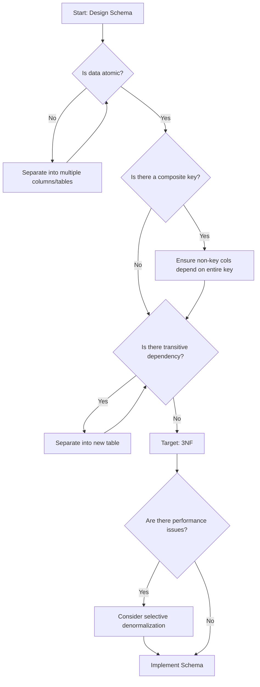
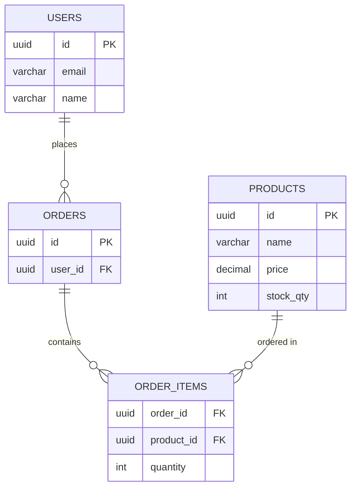

# Database Normalization Guide

## What is Normalization?

Normalization is the process of organizing data to reduce redundancy and improve data integrity. Each normal form represents a set of rules that eliminates certain types of redundancy.

## Normal Forms Overview

| Form | Problem Solved | Common Use |
|------|---------------|------------|
| 1NF | Repeating groups, atomic values | Always (minimum) |
| 2NF | Partial dependencies on composite keys | When using composite keys |
| 3NF | Transitive dependencies | Always (target) |
| BCNF | Key conflicts in 3NF | Rarely needed |
| 4NF | Multi-valued dependencies | Rarely needed |
| 5NF | Join dependencies | Almost never |

**Target for most applications**: 3NF (Third Normal Form)

## First Normal Form (1NF)

**Rule**: All column values must be atomic (indivisible). No repeating groups or arrays.

### Violations

```sql
-- VIOLATION: Multiple values in single cell
CREATE TABLE users (
    id SERIAL PRIMARY KEY,
    name VARCHAR(100),
    phone_numbers VARCHAR(500)  -- '555-1234, 555-5678' - NOT ATOMIC
);

-- VIOLATION: Repeating group
CREATE TABLE orders (
    id SERIAL PRIMARY KEY,
    customer_name VARCHAR(100),
    item1 VARCHAR(100),
    item2 VARCHAR(100),
    item3 VARCHAR(100)  -- Repeating group!
);
```

### Corrected to 1NF

```sql
-- SOLUTION: Separate table for phone numbers
CREATE TABLE users (
    id SERIAL PRIMARY KEY,
    name VARCHAR(100)
);

CREATE TABLE user_phones (
    user_id INTEGER REFERENCES users(id),
    phone_number VARCHAR(20),
    PRIMARY KEY (user_id, phone_number)
);

-- SOLUTION: Junction table for order items
CREATE TABLE orders (
    id SERIAL PRIMARY KEY,
    customer_name VARCHAR(100),
    order_date DATE
);

CREATE TABLE order_items (
    order_id INTEGER REFERENCES orders(id),
    product_id INTEGER REFERENCES products(id),
    quantity INTEGER,
    PRIMARY KEY (order_id, product_id)
);
```

## Second Normal Form (2NF)

**Rule**: 1NF + No partial dependencies on composite keys (all non-key columns must depend on the entire key).

### Violations

```sql
-- VIOLATION: Composite key with partial dependency
CREATE TABLE order_details (
    order_id INTEGER,
    product_id INTEGER,
    customer_name VARCHAR(100),  -- Depends only on order_id, not product_id!
    product_name VARCHAR(100),   -- Depends only on product_id, not order_id!
    quantity INTEGER,
    PRIMARY KEY (order_id, product_id)
);
```

### Corrected to 2NF

```sql
-- SOLUTION: Separate tables with proper foreign keys
CREATE TABLE orders (
    id SERIAL PRIMARY KEY,
    customer_name VARCHAR(100),
    order_date DATE
);

CREATE TABLE products (
    id SERIAL PRIMARY KEY,
    name VARCHAR(100)
);

CREATE TABLE order_items (
    order_id INTEGER REFERENCES orders(id),
    product_id INTEGER REFERENCES products(id),
    quantity INTEGER,
    PRIMARY KEY (order_id, product_id)
);
```

## Third Normal Form (3NF)

**Rule**: 2NF + No transitive dependencies (non-key columns must not depend on other non-key columns).

### Violations

```sql
-- VIOLATION: Transitive dependency
CREATE TABLE products (
    id SERIAL PRIMARY KEY,
    name VARCHAR(100),
    category_id INTEGER,
    category_name VARCHAR(50),  -- Depends on category_id, not directly on PK!
    category_description VARCHAR(200)  -- Also transitive!
);
```

### Corrected to 3NF

```sql
-- SOLUTION: Separate category table
CREATE TABLE categories (
    id SERIAL PRIMARY KEY,
    name VARCHAR(50),
    description VARCHAR(200)
);

CREATE TABLE products (
    id SERIAL PRIMARY KEY,
    name VARCHAR(100),
    category_id INTEGER REFERENCES categories(id)
);
```

## When to Denormalize

Normalization isn't always optimal. Denormalization trades write performance for read performance.

### Common Denormalization Scenarios

| Scenario | Why Denormalize | How |
|----------|----------------|-----|
| Reporting tables | Avoid complex joins | Pre-aggregate data |
| Cached counts | Avoid COUNT queries | Store count in parent |
| Read-heavy workloads | Reduce joins | Add redundant columns |
| Materialized views | Fast aggregations | Pre-compute results |

### Example: Count Denormalization

```sql
-- NORMALIZED (slower reads for count)
SELECT COUNT(*) FROM orders WHERE user_id = 1;

-- DENORMALIZED (faster reads)
CREATE TABLE users (
    id SERIAL PRIMARY KEY,
    name VARCHAR(100),
    order_count INTEGER DEFAULT 0  -- Maintained via triggers/application
);
```

### When NOT to Denormalize

1. **Write-heavy workloads** - Normalized tables have better write performance
2. **Data integrity critical** - Redundant data can become inconsistent
3. **Early in development** - Optimize when you have real performance data

## Practical Decision Framework



## Entity-Relationship Modeling

### Identifying Entities

Look for nouns in requirements:
- Users, customers, employees
- Products, orders, invoices
- Categories, tags, attributes

### Identifying Relationships

Look for verbs connecting entities:
- Users **place** Orders
- Products **belong to** Categories
- Orders **contain** Products

### Relationship Cardinality

| Notation | Meaning | Implementation |
|----------|---------|----------------|
| 1:1 | One-to-one | Foreign key in either table |
| 1:N | One-to-many | Foreign key in "many" table |
| N:N | Many-to-many | Junction table |

### Example ERD → Schema



Becomes:
```sql
CREATE TABLE users (
    id UUID PRIMARY KEY DEFAULT gen_random_uuid(),
    email VARCHAR(255) NOT NULL UNIQUE,
    name VARCHAR(100) NOT NULL
);

CREATE TABLE products (
    id UUID PRIMARY KEY DEFAULT gen_random_uuid(),
    name VARCHAR(255) NOT NULL,
    price DECIMAL(10,2) NOT NULL CHECK (price >= 0),
    stock_qty INTEGER NOT NULL DEFAULT 0 CHECK (stock_qty >= 0)
);

CREATE TABLE orders (
    id UUID PRIMARY KEY DEFAULT gen_random_uuid(),
    user_id UUID NOT NULL REFERENCES users(id),
    created_at TIMESTAMPTZ DEFAULT NOW()
);

CREATE TABLE order_items (  -- Junction table for N:N
    order_id UUID REFERENCES orders(id),
    product_id UUID REFERENCES products(id),
    quantity INTEGER NOT NULL CHECK (quantity > 0),
    PRIMARY KEY (order_id, product_id)
);
```

## Normalization Checklist

- [ ] All tables have a primary key
- [ ] All columns contain atomic values
- [ ] No repeating groups across columns
- [ ] Non-key columns depend on the entire key (for composite keys)
- [ ] No transitive dependencies
- [ ] Foreign keys properly reference parent tables
- [ ] Many-to-many relationships use junction tables

## Summary

| Normal Form | Requirement | Action if Violated |
|-------------|-------------|-------------------|
| 1NF | Atomic values, no repeating groups | Separate into child tables |
| 2NF | Full dependency on composite keys | Move partial dependencies to separate tables |
| 3NF | No transitive dependencies | Move dependent columns to separate tables |

**Default target**: Third Normal Form (3NF)
**Denormalization decision**: Based on measured performance requirements, not speculation
