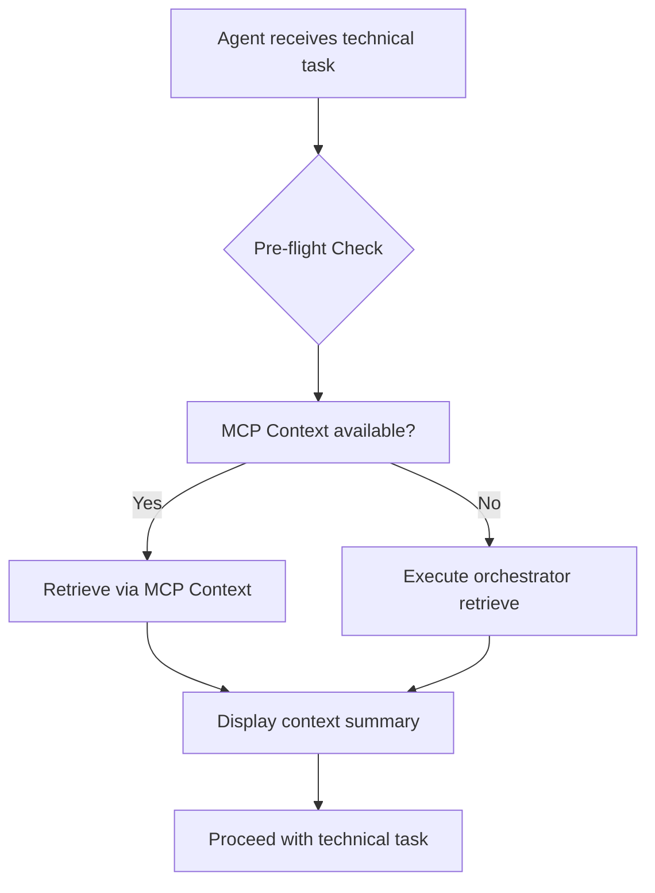
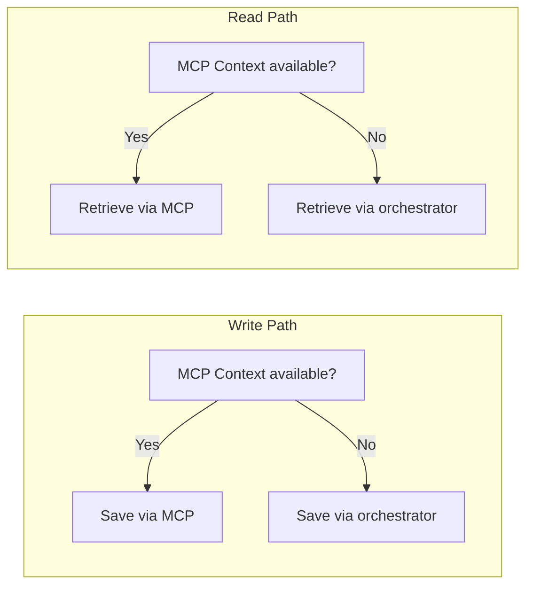
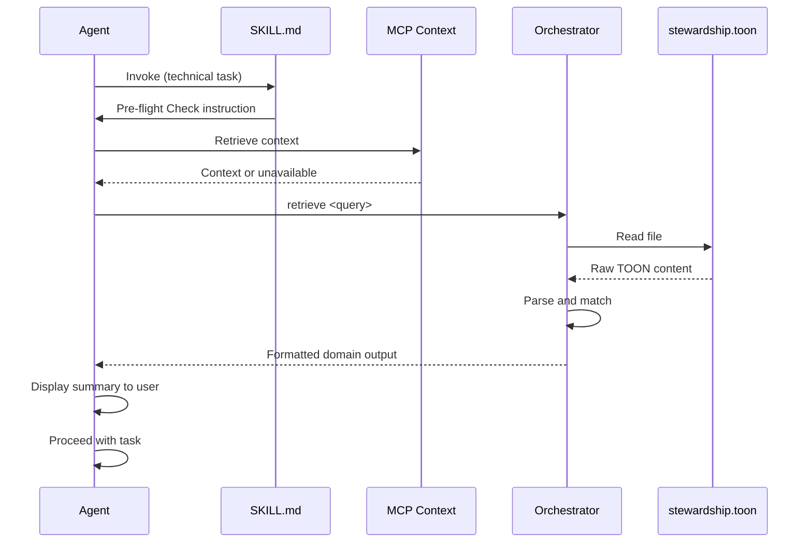

# Design Document

## Overview

This design extends the Contextual Stewardship AgentSkill from a write-only memory system to a bidirectional read/write system. The skill instructs agents to retrieve contextual memory BEFORE proposing architectures, writing code, or making technical decisions (Pre-flight Check pattern), while maintaining the existing save behavior for new decisions.

The orchestrator script is refactored to route commands based on argument prefix: `retrieve <query>` triggers search mode, while bare TOON content triggers append mode. The graceful degradation chain remains unchanged for both directions.

### Change Type

enhancement

### Design Goals

1. Enable agents to retrieve project context before technical actions
2. Maintain existing save behavior without breaking changes
3. Preserve graceful degradation chain for both read and write operations

### References

- **REQ-1**: Pre-flight Context Retrieval
- **REQ-2**: Bidirectional Command Support
- **REQ-3**: Graceful Degradation for Retrieval
- **REQ-4**: Graceful Degradation for Persistence
- **REQ-5**: Skill Trigger Update
- **REQ-6**: Retrieval Output Format

## System Architecture

### DES-1: Skill Trigger and Retrieval Instruction

The SKILL.md is updated to instruct agents to perform a Pre-flight Check before any technical task. The skill description and workflow sections are expanded to include retrieval instructions alongside existing save instructions.

The retrieval trigger activates when the user asks to implement a feature, write code, plan architecture, or make a technical decision.

**Responsibility:** Instruct agents to invoke retrieval mechanism before technical actions.



_Implements: REQ-1.1, REQ-1.2, REQ-1.3, REQ-5.1, REQ-5.2_

### DES-2: Orchestrator Command Router

The orchestrator.js script is refactored to detect command type from the first argument. If the argument starts with `retrieve ` (with trailing space), it enters search mode. Otherwise, it performs the existing save operation.

**Responsibility:** Route commands to appropriate operation mode (retrieve or save).

```mermaid
flowchart TD
    A[orchestrator.js args] --> B{Command detection}
    B -->|starts with "retrieve "| C[Search mode]
    B -->|else| D[Save mode]
    C --> E[Parse query]
    E --> F[Read stewardship.toon]
    F --> G[Match entries against query]
    G --> H[Format output by domain]
    D --> I[Append TOON content to file]
    I --> J[Confirm save]
    H --> K[Display formatted results]
```

_Implements: REQ-2.1, REQ-2.2, REQ-2.3, REQ-6.1, REQ-6.2, REQ-6.3_

### DES-3: Bidirectional Graceful Degradation Chain

Both read and write operations follow a two-tier graceful degradation chain. Tier 1 uses MCP Context tools when available. Tier 2 falls back to the local TOON file via the orchestrator script.

**Responsibility:** Ensure context access and persistence always succeed regardless of MCP availability.



_Implements: REQ-3.1, REQ-3.2, REQ-3.3, REQ-4.1, REQ-4.2, REQ-4.3_

## Data Flow

### Retrieval Flow



## Code Anatomy

| File Path | Purpose | Implements |
|-----------|---------|------------|
| contextual-stewardship/SKILL.md | Update trigger description, add retrieval workflow section | DES-1 |
| contextual-stewardship/scripts/orchestrator.js | Add command routing, implement retrieve mode | DES-2 |

## Error Handling

| Error Condition | Response | Recovery |
|----------------|----------|----------|
| TOON file does not exist | Return "No entries found" | Create empty file on next save |
| Query returns no matches | Return "No matching entries found" | Inform user to add new rules |
| MCP unavailable | Fall back to orchestrator | Graceful degradation continues |

## Traceability Matrix

| Design Element | Requirements |
|----------------|--------------|
| DES-1 | REQ-1.1, REQ-1.2, REQ-1.3, REQ-5.1, REQ-5.2 |
| DES-2 | REQ-2.1, REQ-2.2, REQ-2.3, REQ-6.1, REQ-6.2, REQ-6.3 |
| DES-3 | REQ-3.1, REQ-3.2, REQ-3.3, REQ-4.1, REQ-4.2, REQ-4.3 |
