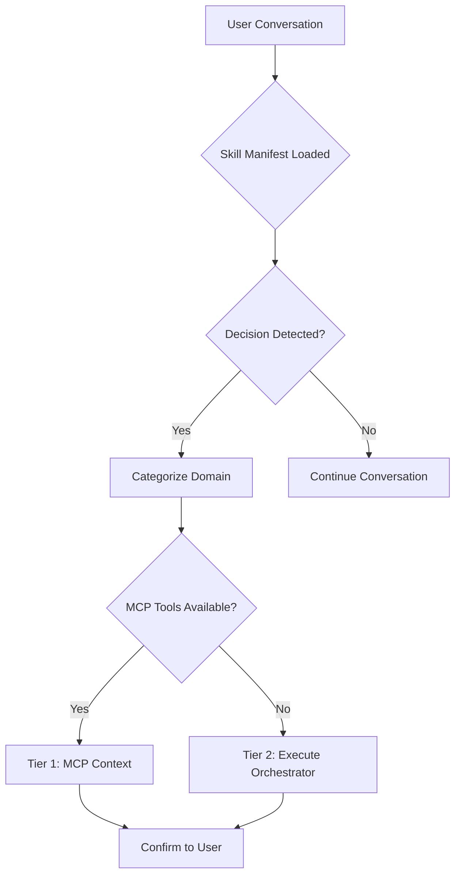
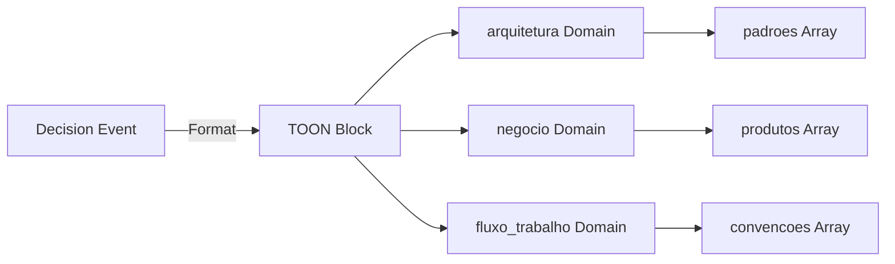
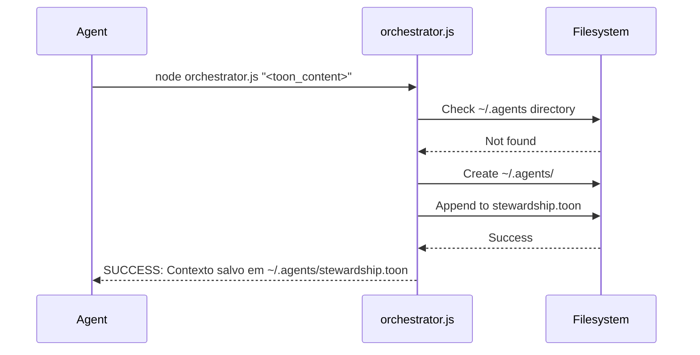

# Design Document

## Overview

The Contextual Stewardship AgentSkill provides AI agents with Staff Engineer capabilities to extract, categorize, and persist architectural decisions and business rules. The skill operates by monitoring conversation context, identifying extractable decisions, and storing them through a two-tier persistence strategy: MCP Context tools when available, or local TOON-formatted files as fallback.

The design separates concerns into three core components: the Skill Manifest (entry point with behavior instructions), the TOON Specification (token-efficient format reference), and the Orchestrator Script (fallback persistence logic).

### Change Type

new-feature

### Design Goals

1. Enable AI agents to act as Staff Engineers by proactively extracting and persisting project decisions
2. Minimize context token overhead through external structured storage
3. Ensure zero data loss through graceful degradation across persistence tiers

### References

- **REQ-1**: Decision Extraction
- **REQ-2**: Graceful Degradation Persistence
- **REQ-3**: TOON Format Output
- **REQ-4**: Skill Structure
- **REQ-5**: Orchestrator Behavior
- **REQ-6**: Confirmation to User

## System Architecture

### DES-1: Skill Manifest

The Skill Manifest (`SKILL.md`) serves as the primary entry point and behavior说明书 for the agent. It defines the extraction logic, decision domains, and delegation strategy for persistence.

The manifest uses YAML frontmatter for skill metadata and markdown body for behavioral instructions. It instructs the agent to monitor conversations, categorize decisions into three domains (`arquitetura`, `negocio`, `fluxo_trabalho`), and delegate persistence using the fallback script when MCP tools are unavailable.

_Implements: REQ-1.1, REQ-1.2, REQ-1.3, REQ-1.4, REQ-2.1, REQ-2.2, REQ-6.1, REQ-6.2_

### DES-2: TOON Format Specification

The TOON Specification (`references/TOON_SPEC.md`) defines the token-efficient data format used for local cold storage. It is loaded by the agent only when Tier 2 persistence is required, keeping the main manifest lean.

The format uses a flat, domain-block structure with array notation. Each domain contains typed arrays with schema definitions, enabling minimal token consumption during future context retrieval.

_Implements: REQ-3.1, REQ-3.2, REQ-3.3_

### DES-3: Orchestrator Script

The Orchestrator Script (`scripts/orchestrator.js`) provides the fallback persistence mechanism when MCP Context tools are unavailable. It is invoked via command line with TOON-formatted content as an argument.

The script appends new decision blocks to `~/.agents/stewardship.toon`, creating the directory and file if they do not exist. It handles filesystem errors gracefully and provides appropriate exit codes.

_Implements: REQ-5.1, REQ-5.2, REQ-5.3_

## Code Anatomy

| File Path | Purpose | Implements |
|-----------|---------|------------|
| contextual-stewardship/SKILL.md | Skill manifest with YAML frontmatter and behavior instructions | DES-1 |
| contextual-stewardship/references/TOON_SPEC.md | TOON format specification for cold storage | DES-2 |
| contextual-stewardship/scripts/orchestrator.js | Node.js fallback script for TOON file persistence | DES-3 |

## Traceability Matrix

| Design Element | Requirements |
|----------------|--------------|
| DES-1 | REQ-1.1, REQ-1.2, REQ-1.3, REQ-1.4, REQ-2.1, REQ-2.2, REQ-6.1, REQ-6.2 |
| DES-2 | REQ-3.1, REQ-3.2, REQ-3.3 |
| DES-3 | REQ-5.1, REQ-5.2, REQ-5.3 |
